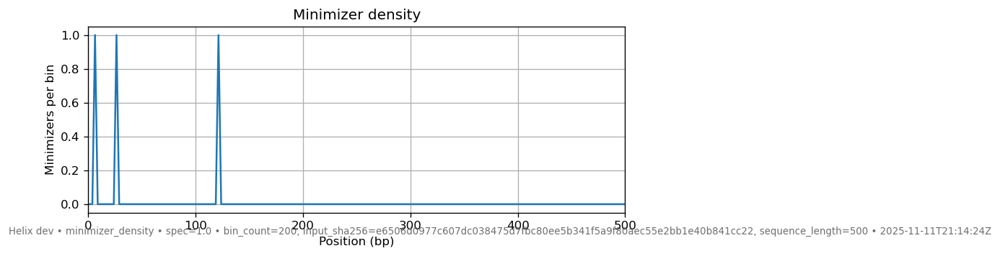
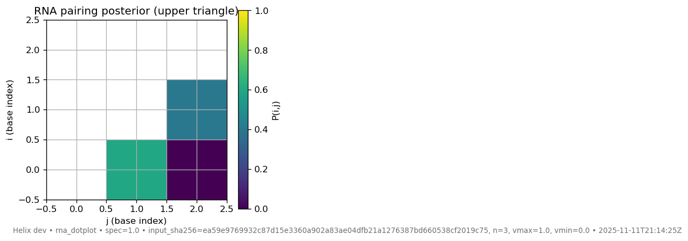
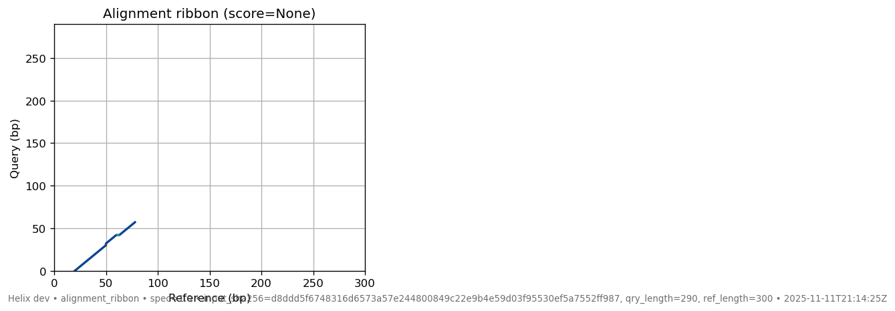
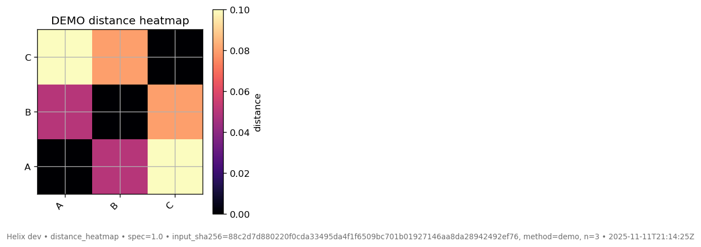

# Visualization JSON Schemas

> **Current viz-spec version:** 1.0 (backwards compatibility is maintained for at least the next two Helix releases). Every viz-spec JSON embeds this version alongside a timestamp and an `input_sha256` so the figure footer cryptographically references the exact JSON that produced it.

- Inspect schemas directly from the CLI: `helix viz schema` (lists keys) or `helix viz schema --kind viz_motif_logo` (pretty JSON schema).
- Generate ready-to-plot payloads + screenshots via `helix demo viz --output demo_viz/`—the gallery at the end of this page was produced with that command.

Every renderer under `helix viz ...` consumes a small JSON contract. The schemas below are append-only; version bumps surface via the `spec_version` embedded in each viz-spec JSON as well as the figure footer.

## Minimizer Density (`helix viz minimizers`)
```json
{
  "sequence_length": 12345,
  "minimizers": [42, [100, "ACG", 1234567], {"pos": 777}]
}
```

- `sequence_length` (int) – total sequence length.
- `minimizers` (array) – accepts raw positions (`int`), tuples like `[pos, kmer]` or `[pos, kmer, hash]`, and dicts containing `pos`, `position`, or `ref_start`.

## Seed Chain (`helix viz seed-chain`)
```json
{
  "ref_length": 1200,
  "qry_length": 1100,
  "chains": [
    [{"ref_start":100,"ref_end":160,"qry_start":90,"qry_end":150}],
    [{"ref_start":400,"ref_end":450,"qry_start":390,"qry_end":440}]
  ]
}
```

- `ref_length` / `qry_length` (ints) – axis bounds for the reference and query.
- `chains` (list[list[anchor]]) – each anchor needs `ref_start`/`qry_start` plus either `ref_end`/`qry_end` or `len`.

## RNA Dot-Plot (`helix viz rna-dotplot`)
```json
{ "posterior": [[0,0.7,0],[0.7,0,0.4],[0,0.4,0]] }
```

- `posterior` (n×n floats in `[0,1]`) – the upper triangle is plotted; the lower triangle is ignored.

## Alignment Ribbon (`helix viz alignment-ribbon`)
```json
{
  "ref_length": 500,
  "qry_length": 480,
  "cigar": "50M2I20M3D30M",
  "ref_start": 100,
  "qry_start": 95,
  "metadata": {"name":"read_001","score":87}
}
```

- `ref_length`, `qry_length` (ints) – axis bounds; fall back to `ref_end`/`read_end` if omitted.
- `cigar` (SAM string) – supports `M`, `=`, `X`, `I`, `D`.
- `ref_start`, `qry_start` (ints) – 0-based alignment anchors.
- `metadata` (object, optional) – echoed into the viz-spec and footer for provenance.

Outputs from `helix seed map` already match this schema via the `meta`/`results` structure; `helix viz alignment-ribbon` accepts those JSON blobs directly.

## Distance Heatmap (`helix viz distance-heatmap`)
```json
{
  "labels": ["A","B","C"],
  "matrix": [[0,0.05,0.10],[0.05,0,0.12],[0.10,0.12,0]]
}
```

- `labels` (list[str]) – row/column labels.
- `matrix` (n×n floats) – symmetric distance matrix (diagonal usually zero).

To plot a matrix emitted by `helix sketch compare --json dist.json`, pass that file to `helix viz distance-heatmap`.

## Motif Logo (`helix viz motif-logo`)
```json
{
  "alphabet": ["A","C","G","T"],
  "pwm": [
    [0.25,0.25,0.25,0.25],
    [0.05,0.05,0.85,0.05],
    [0.6,0.1,0.1,0.2]
  ],
  "background": [0.25,0.25,0.25,0.25]
}
```

- `alphabet` (list[str]) – order for PWM columns; defaults to `["A","C","G","T"]`.
- `pwm` (L×|Σ| floats or list of dicts) – probabilities per symbol; each column is normalized if needed.
- `background` (|Σ| floats, optional) – background distribution for information-content scaling (defaults to uniform).

## Reproducible Viz & Viz-Spec

- All viz commands support `--save out.png` (PNG/SVG/PDF) and automatically emit a matching `.viz.json` unless `--save-viz-spec` overrides the destination. The `meta.input_sha256` ties each plot to its JSON input.
- Every viz-spec includes `kind`, `meta`, `primitives`, `spec_version`, and a timestamp; the figure footer mirrors this information for easy provenance.
- Tests assert against viz-spec metrics (counts, quantiles, densities) rather than raw pixels, keeping the suite deterministic across platforms.
- Producers such as `helix seed map`, `helix sketch compare`, and `helix motif find` now stamp `spec_version` into their JSON outputs so downstream users can validate artifacts.
- Whenever you write a PNG via `--save`, Helix drops a sibling `<image>.provenance.json` that captures `{schema_kind, spec_version, input_sha256, viz_spec_sha256, image_sha256, helix_version, command}`, giving every figure a cryptographic audit trail.

## Demo Gallery

Run `helix demo viz --output docs/assets/viz` to recreate the screenshots below (each PNG is paired with a `.viz.json` containing the schema metadata):

| Visualization | Preview |
| ------------- | ------- |
| Minimizer density |  |
| Seed chaining |  |
| RNA dot-plot |  |
| Alignment ribbon |  |
| Distance heatmap |  |
| Motif logo |  |
